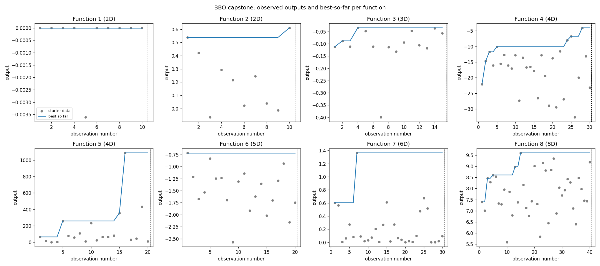

# IC-ML-AI-Capstone: Black-Box Optimisation Challenge

## Summary

This project is the capstone for the Imperial College London / Emeritus Professional Certificate in Machine Learning and Artificial Intelligence. The challenge is to find the inputs that give the highest output for eight hidden functions, without knowing their formulas and with only one test per function each round. This is like tuning an expensive experiment, such as a drug formulation or a factory process, where every test costs time and money. Each round, a statistical model learns from all results so far and suggests the most promising next test, balancing safe improvements against trying unexplored options. This repository records that process, its results and its limitations.

## Repository Structure

```
IC-ML-AI-Capstone/
├── README.md
├── requirements.txt
├── Data/
│   ├── function_1/ ... function_8/
│   │   ├── initial_inputs.npy       official starter inputs
│   │   └── initial_outputs.npy      official starter outputs
│   └── submissions.json             my queries + real portal outputs, by round
├── Code/
│   ├── bbo_core.py                  data loading, GP surrogate, acquisition, formatting
│   ├── run_round.py                 produces one query per function for a round
│   ├── plot_progress.py             best-so-far plot for all eight functions
│   └── BBO_round_walkthrough.ipynb  step-by-step notebook version of a round
├── Results/
│   ├── round_NN_queries.json        query, settings, seed and diagnostics per round
│   └── progress.png                 progress plot
└── Documentation/
    ├── Datasheet.md
    └── Model_Card.md
```

## Documentation

- **[Datasheet](Documentation/Datasheet.md)**: what the data is, how it was collected, transformations, intended uses and limitations.
- **[Model Card](Documentation/Model_Card.md)**: how the optimiser works, settings per function and why, performance metrics, assumptions, limitations and ethics.

## The Problem

- Eight functions with 2 to 8 inputs each, every input between 0 and 1
- Each returns one number, and every function is treated as **maximisation**
- One query per function per round, submitted through the capstone portal as `x1-x2-...-xn` (six decimals, hyphens, no spaces)

## Approach

Bayesian optimisation with a Gaussian Process surrogate for each function. The GP predicts both a value and its uncertainty, and an acquisition function (Upper Confidence Bound or Expected Improvement) picks the next query by balancing the two. Settings are tuned per function from the official descriptions and the observed data. See the [Model Card](Documentation/Model_Card.md) for the full table.

**Why Bayesian optimisation?** Evaluations are expensive and limited, the functions may be noisy and have several peaks, and Bayesian optimisation is designed to make the most of every evaluation by using uncertainty to decide where to look next.

## How to Run a Round

```bash
pip install -r requirements.txt

# 1. Log last round's real portal results in Data/submissions.json, e.g.
#    "function_1": [{"round": 1, "x": [0.214116, 0.834905], "y": 0.123}]

# 2. Generate this round's queries (add --loo for leave-one-out diagnostics)
python Code/run_round.py --round 2 --loo

# 3. Update the progress plot
python Code/plot_progress.py
```

Or open `Code/BBO_round_walkthrough.ipynb` from inside the `Code/` folder and run all cells.

## Results



| Function | Best output so far | Round |
|---|---|---|
| 1 | *(update after each round)* | |
| 2 | | |
| 3 | | |
| 4 | | |
| 5 | | |
| 6 | | |
| 7 | | |
| 8 | | |

## Challenges and Insights

*(Add as the project progresses, e.g. which functions were hardest, which settings changed and why, what surprised you.)*
